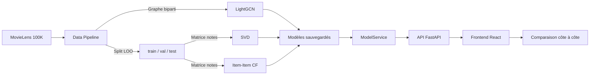

# Système de Recommandation de Films : LightGCN (GNN) vs Baselines Classiques

> **Projet de fin d'année - Comparaison empirique d'approches de filtrage collaboratif sur MovieLens 100K**

---

## 1. Vue d'ensemble concrète

**Le problème :** On dispose d'un historique de notes que des utilisateurs ont attribuées à des films (MovieLens 100K). L'objectif est de construire un système capable de prédire quels films un utilisateur aimera, sans connaître ses goûts à l'avance, en se basant uniquement sur son historique et celui des autres.

**La valeur ajoutée :** Au lieu de se contenter d'approches classiques (factorisation matricielle SVD ou similarité entre films Item-Item), ce projet expérimente une approche moderne par **réseau de neurones sur graphe (LightGCN)** et compare rigoureusement les deux familles. Le tout est packaged dans une application web interactive pour visualiser les recommandations côte à côte en temps réel.

---

## 2. Architecture & Rôles des Composants

### Data Engineering (`src/data_pipeline/`)

**Mission :** Transformer les fichiers bruts de MovieLens en un format prêt pour le machine learning, sans fuite de données.

**Comment ça marche concrètement :**

1. **Téléchargement & Parsing** (`download.py`) : On récupère l'archive MovieLens, on extrait les notes (`u.data`) et les métadonnées films (`u.item`), puis on standardise tout dans des DataFrames propres avec des colonnes fixes : `user_id`, `item_id`, `rating`, `timestamp`.

2. **Split Temporel Leave-One-Out (LOO)** (`temporal_split.py`) : C'est LA règle d'or pour évaluer un système de recommandation sans tricher.
   
   > **Analogie simple :** Imagine que tu veux tester si un élève a vraiment compris son cours. Tu lui enlèves la dernière leçon (test) et l'avant-dernière (validation), et tu vérifies s'il peut prédire ce qu'il y avait dans ces leçons en ne regardant que les anciennes. C'est exactement ce qu'on fait ici : pour chaque utilisateur, on garde **seulement** son interaction la plus récente pour le test, l'avant-dernière pour la validation, et tout le reste pour l'entraînement. Cela garantit qu'on ne "triche" pas en utilisant des données futures pour prédire le passé.

3. **Construction du Graphe Biparti** (`graph_builder.py`) : On crée un graphe où :
   - Les **nœuds du haut** sont les utilisateurs
   - Les **nœuds du bas** sont les films
   - Les **arêtes** sont les notes (interactions) présentes **uniquement dans le train set**
   
   Ce graphe est la "matière première" que LightGCN va parcourir pour apprendre des représentations (embeddings) des utilisateurs et des films.

---

### Machine Learning (`src/models/`)

**Mission :** Entraîner trois modèles différents sur les mêmes données et évaluer leurs performances avec des métriques rigoureuses.

**Comment chacun "voit" les films :**

| Modèle | Analogie concrète | Comment ça marche |
|--------|-------------------|-------------------|
| **SVD** | Factorisation de matrice : on devine les goûts cachés | Décompose la grande matrice "utilisateurs × films" en deux petites matrices (goûts des utilisateurs × caractéristiques des films). Pour prédire, on fait le produit scalaire entre le goût d'un utilisateur et les caractéristiques d'un film. |
| **Item-Item CF** | "Tu as aimé ce film ? Tu aimeras sûrement ses cousins" | Pour un utilisateur, regarde les films qu'il a déjà aimés, trouve les films les plus similaires (même genre, même public), et recommande ceux-ci. La similarité est calculée par la note moyenne des autres utilisateurs. |
| **LightGCN** | "Dis-moi qui tu fréquentes, je te dirai qui tu es" | Le modèle parcourt le graphe : il regarde les films qu'un utilisateur a aimés, puis les utilisateurs qui ont aimé ces films, puis d'autres films que ces utilisateurs ont aimés, etc. Après plusieurs "couches" de propagation, il obtient une représentation riche de chaque utilisateur et film. |

**Métriques d'évaluation - ce qu'elles mesurent dans la vraie vie :**

- **Recall@K** : "Parmi les 10 films que le système recommande, combien se trouvent dans le top de l'utilisateur ?" Si Recall@10 = 0.2, cela signifie qu'en moyenne, le système trouve 1 film sur 5 que l'utilisateur a effectivement vu et apprécié.
- **NDCG@K** : "Est-ce que les bons films sont en haut de la liste ?" Un NDCG élevé signifie que les films pertinents ne sont pas seulement dans le top 10, mais en **première position** (position 1, 2, 3...). C'est plus exigeant que le Recall.

---

### Backend FastAPI (`src/api/` et `src/services/`)

**Mission :** Faire le pont entre l'interface web et les modèles de machine learning, en chargeant les modèles **une seule fois** en mémoire.

**Le Pattern Singleton - `ModelService` (`model_service.py`) :**

> **Pourquoi charger le modèle une seule fois ?**  
> Les modèles (surtout LightGCN avec ses embeddings et sa matrice d'adjacence) peuvent être gourmands en mémoire. Si on les recharge à chaque requête, l'API deviendrait lente. Le `ModelService` est une instance globale créée au démarrage de l'application. Toutes les requêtes partagent cette même instance, donc les modèles restent en RAM et les calculs sont instantanés.

**Rôle précis :**
- Au démarrage (`lifespan` dans `main.py`), il charge :
  - Les métadonnées des films (`movies_cleaned.csv`)
  - Les mappings d'identifiants (`id_mappings.json`) pour convertir les IDs MovieLens bruts en indices internes
  - Les trois modèles entraînés (`.pt` pour LightGCN, `.pkl` pour SVD et Item-Item)
- Pour chaque requête, il appelle les bons modèles, convertit les résultats en format JSON avec titre/genres du film, et renvoie la réponse au frontend.

**Endpoints clés :**
- `GET /api/v1/users` - Liste des utilisateurs connus
- `GET /api/v1/recommendations/{user_id}?top_n=5` - Recommandations côte à côte (LightGCN, SVD, Item-Item)
- `GET /` - Healthcheck

---

### Frontend React (`frontend/`)

**Mission :** Offrir une interface intuitive pour comparer visuellement les recommandations des trois modèles.

En une phrase : l'interface permet de sélectionner un utilisateur, d'afficher son historique, et de voir en temps réel le **Top 5 des films recommandés par LightGCN**, **SVD** et **Item-Item CF** côte à côte, avec les titres, genres et scores de pertinence.

---

## 3. Guide de Démarrage Rapide (2 minutes)

### Option A : Docker Compose (recommandé)

```bash
# Construire les images et démarrer tous les services
docker compose up --build
```

Puis ouvrir :
    - **Interface de comparaison** : http://localhost
    - **Documentation API (Swagger)** : http://localhost:8000/docs

> **Note :** En développement, vous pouvez monter les volumes source (`./src:/app/src`, `./frontend/src:/app/src`) pour itérer rapidement. Pour utiliser le mode développement avec rechargement à chaud, remplacez temporairement les Dockerfiles par leurs versions `dev` (`--reload` pour uvicorn, `npm run dev` pour Vite).

### Option B : Installation locale (sans Docker)

```bash
# 1. Backend - installer les dépendances Python
python -m venv venv
.\venv\Scripts\activate  # Windows
# source venv/bin/activate  # macOS/Linux
pip install -r requirements.txt

# 2. Générer les artefacts (modèles + données) - À FAIRE UNE SEULE FOIS
python -m scripts.run_pipeline --dataset 100k

# 3. Lancer le backend
uvicorn src.api.main:app --reload --port 8000

# 4. Dans un autre terminal - lancer le frontend
cd frontend
npm install
npm run dev
```

Puis ouvrir http://localhost:5173

---

## 4. Arborescence Simplifiée & Dictionnaire des Fichiers Clés

```text
recommender-gnn-vs-cf/
│
├── docker-compose.yml              # Orchestration Docker : api + frontend + nginx
├── Dockerfile.backend              # Image Python/FastAPI pour le backend
├── requirements.txt                # Dépendances Python (dev + ML)
├── requirements-prod.txt           # Dépendances Python (production, sans outils de dev)
│
├── data/
│   ├── raw/                        # Datasets MovieLens bruts (100K / 1M) - .gitignore
│   └── processed/                  # Données nettoyées, splits temporels, graphes sauvegardés
│       └── 100k/
│           ├── train.csv           # Interactions d'entraînement
│           ├── val.csv             # Interactions de validation
│           └── test.csv            # Interactions de test (1 par utilisateur)
│
├── src/
│   ├── data_pipeline/              # DATA ENGINEER
│   │   ├── config.py               # Chemins, URLs MovieLens, constantes globales
│   │   ├── download.py             # Téléchargement + parsing MovieLens 100K/1M
│   │   ├── temporal_split.py       # Split Leave-One-Out (train/val/test)
│   │   ├── graph_builder.py        # Construction du graphe biparti Utilisateur-Item
│   │   └── mlflow_tracking.py      # Tracking des expériences ML (optionnel)
│   │
│   ├── models/                     # ML ENGINEER
│   │   ├── common.py               # Interface abstraite Recommender (contrat commun)
│   │   ├── baselines.py            # SVD + Item-Item CF (scikit-surprise)
│   │   └── lightgcn.py             # LightGCN (PyTorch pur, propagation + BPR loss)
│   │
│   ├── evaluation/                 # MÉTRIQUES
│   │   └── metrics.py              # Precision@K, Recall@K, NDCG@K + protocole d'évaluation
│   │
│   └── api/                        # BACKEND
│       └── main.py                 # Application FastAPI, endpoints, CORS, lifespan
│
├── src/services/
│   └── model_service.py            # Singleton : charge les artefacts, génère les recommandations
│
├── scripts/
│   ├── run_pipeline.py             # Script "tout-en-un" : télécharge, split, entraîne, sauvegarde
│   ├── train_baselines.py          # Entraînement SVD + Item-Item CF
│   ├── train_lightgcn.py           # Entraînement LightGCN (BPR + ablation profondeur)
│   └── build_comparison_table.py   # Génère le tableau comparatif des métriques
│
├── models/                         # Artefacts entraînés (à ignorer sur Git)
│   ├── lightgcn_best.pt            # Modèle LightGCN sauvegardé (PyTorch)
│   ├── svd_model.pkl               # Modèle SVD sauvegardé (scikit-surprise)
│   ├── item_item_model.pkl         # Modèle Item-Item CF sauvegardé (dict précalculé)
│   └── id_mappings.json            # Conversion IDs MovieLens bruts ↔ indices internes
│
├── frontend/                       # FRONTEND
│   ├── src/
│   │   ├── App.jsx                 # Composant principal : sélection utilisateur + 3 colonnes de reco
│   │   └── main.jsx                # Point d'entrée React
│   ├── Dockerfile.frontend         # Image Node.js pour le frontend
│   └── package.json                # Dépendances React + Vite + Axios + Lucide icons
│
├── tests/
│   ├── test_lightgcn.py            # Tests unitaires LightGCN (graphe, propagation, loss)
│   └── test_metrics.py             # Tests unitaires métriques (Precision, Recall, NDCG)
│
└── nginx/
    └── default.conf                # Reverse proxy : / → frontend, /api/ → backend
```

---

## 5. Comment tout fonctionne ensemble (vue d'ensemble)



1. **Data Pipeline** nettoie les données et crée le split LOO + le graphe biparti.
2. **ML Engineer** entraîne les 3 modèles sur le train set et les sauvegarde.
3. **Backend** charge les modèles une seule fois (Singleton) et expose une API REST.
4. **Frontend** interroge l'API et affiche les recommandations des 3 modèles pour l'utilisateur sélectionné.

---

## 6. Points techniques clés à connaître

### Pourquoi Leave-One-Out et pas un split aléatoire ?
Un split aléatoire mélange les interactions anciennes et récentes. Le modèle pourrait "voir" des interactions futures à l'entraînement et avoir un score artificiellement bon. Le LOO est **réaliste** : on entraîne sur le passé, on prédit le futur le plus proche.

### Pourquoi LightGCN sans couches cachées non-linéaires ?
LightGCN a été conçu pour être le plus simple possible : pas de fonction d'activation (ReLU), pas de poids entre couches. La propagation se fait uniquement par multiplication sparse avec la matrice d'adjacence normalisée. Cela réduit le risque d'over-fitting et rend le modèle plus interprétable.

### Qu'est-ce que l'over-smoothing ?
Si on augmente trop la profondeur du GNN (nombre de couches), les embeddings des nœuds deviennent tous semblables (comme si tout le monde se ressemblait après trop de " téléphone arabe "). C'est l'over-smoothing : le modèle perd sa capacité à distinguer les utilisateurs et les films, et les performances chutent.

---

## 7. Lancer les tests

```bash
# Tests unitaires (pytest)
pytest tests/ -v

# Tests spécifiques
pytest tests/test_lightgcn.py -v
pytest tests/test_metrics.py -v
```

---

## 8. Workflow Git pour l'équipe

| Branche | Rôle |
|---------|------|
| `main` | Version stable, testée, prête pour la démo/soutenance |
| `feature/data-pipeline` | Modifications du pipeline de données |
| `feature/models-lightgcn` | Implémentation/amélioration de LightGCN |
| `feature/fastapi-backend` | Nouveaux endpoints, refacto backend |
| `feature/frontend-ui` | Améliorations de l'interface |

**Règle d'or :** Une fonctionnalité = une branche + une Pull Request vers `main`.

---

## 9. Résultats attendus (après entraînement)

Les métriques sont sauvegardées dans `results/` :
- `comparison_table.md` - Tableau comparatif LightGCN vs SVD vs Item-Item
- `baselines_metrics.csv` - Métriques détaillées des baselines
- `ablation_depth.png` - Graphique de l'étude d'ablation (performance vs profondeur)

---

## 10. FAQ rapide

**Q : Pourquoi LightGCN au lieu d'un GCN classique ?**
R : LightGCN est optimisé pour le filtrage collaboratif : il retire les non-linéarités inutiles et se concentre sur la propagation de voisinage, ce qui donne de meilleurs résultats sur les datasets de recommandation.

**Q : Comment sont gérés les utilisateurs froids (cold-start) ?**
R : Ils ne sont **pas gérés** dans cette version. Si un utilisateur n'existe pas dans le dataset d'entraînement, l'API renvoie une erreur 404.

**Q : Peut-on utiliser le dataset 1M au lieu de 100K ?**
R : Oui ! Il suffit de lancer `python -m scripts.run_pipeline --dataset 1m`. Le pipeline gère automatiquement les différences de format.

---
